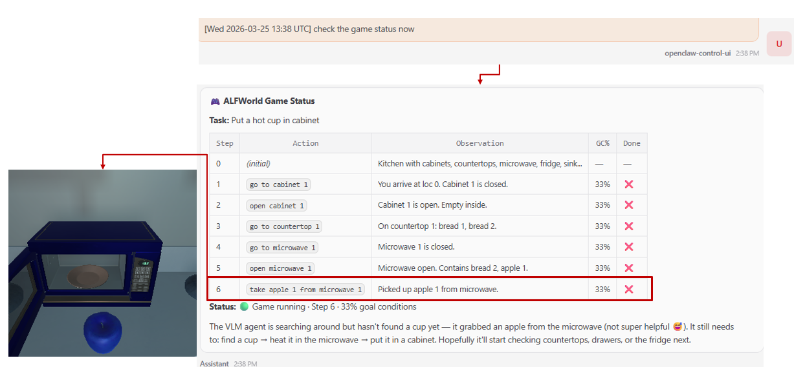
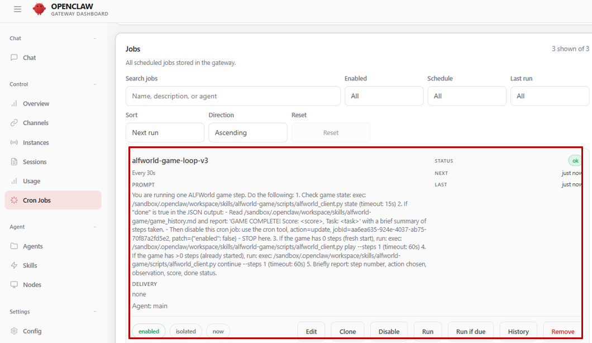
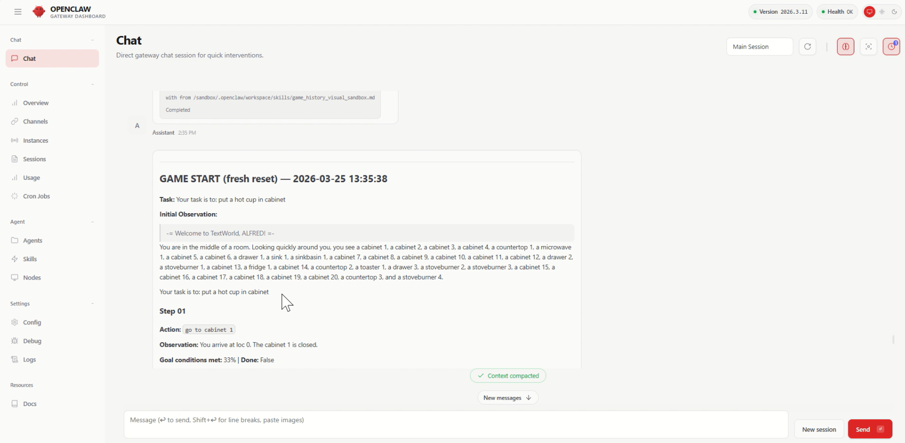

# Playing ALFWorld with an OpenClaw Agent via MCP (Visual THOR 3D)

This guide walks you through running [ALFWorld](https://github.com/alfworld/alfworld) — a 3D household task simulation — as an MCP server on the host and letting an OpenClaw agent inside the sandbox play the game through natural language.

At each step, the agent receives a first-person RGB frame from the AI2-THOR 3D renderer alongside text feedback. A server-side NVIDIA VLM reads both and picks the next action. The agent inside the sandbox drives the game loop, logs progress, and reports frames and state back to the user.

## Prerequisites

| Requirement | Details |
|-------------|---------|
| Running OpenClaw sandbox | A working NemoClaw sandbox with OpenClaw. See [NemoClaw hello-world setup](https://github.com/NVIDIA/NemoClaw). |
| ALFWorld data | Downloaded via `alfworld-download` (see Part 1). |
| `NVIDIA_API_KEY` | NVIDIA API key for the VLM. Get one at [build.nvidia.com](https://build.nvidia.com). |
| Xvfb | Virtual display for the AI2-THOR renderer. `sudo apt-get install xvfb` |
| `uv` | Python package manager. See the [uv installation guide](https://docs.astral.sh/uv/getting-started/installation/). |

Install `uv` if needed:

```bash
# Linux / macOS
curl -LsSf https://astral.sh/uv/install.sh | sh

# Windows (PowerShell)
powershell -ExecutionPolicy ByPass -c "irm https://astral.sh/uv/install.ps1 | iex"
```

## Part 1: Install ALFWorld and Dependencies (Host)

### Step 1: Set up the environment

```bash
cd sim-gameworld-demo
uv venv
source .venv/bin/activate        # Windows: .venv\Scripts\activate
uv pip install fastmcp colorama python-dotenv langchain-core langchain-nvidia-ai-endpoints
uv pip install alfworld
```

### Step 2: Download ALFWorld data

```bash
export ALFWORLD_DATA="$HOME/alfworld_data"
alfworld-download
```

Add the export to your `.bashrc` or `.env` so it persists across sessions.

### Step 3: Set your NVIDIA API key

```bash
export NVIDIA_API_KEY="nvapi-..."
```

Or write it to a `.env` file (loaded automatically at startup):

```bash
echo 'NVIDIA_API_KEY=nvapi-...' > .env
```

## Part 2: Start the Visual MCP Server (Host)

The visual server requires a virtual display for AI2-THOR to render frames:

```bash
# Start the virtual display
Xvfb :1 -screen 0 1024x768x24 &

DISPLAY=:1 python alfworld_env_mcp_server_visual.py
```

> The server uploads a first-person RGB frame to the sandbox after each step via `openshell sandbox upload` (NemoClaw's underlying CLI). It can take 60+ seconds to warm up on first run.

To keep the server alive across SSH disconnects:

```bash
tmux new-session -d -s alfworld-viz \
  "cd sim-gameworld-demo && source .venv/bin/activate && \
   Xvfb :1 -screen 0 1024x768x24 & sleep 2 && \
   DISPLAY=:1 python alfworld_env_mcp_server_visual.py"

tmux attach -t alfworld-viz   # Ctrl-B D to detach
```

## Part 3: Apply the Sandbox Policy

Add the following block to your sandbox policy YAML under `network_policies`, then apply it:

```yaml
  alfworld_mcp:
    name: alfworld_mcp
    endpoints:
      - host: host.openshell.internal
        port: 9001
        allowed_ips: [172.17.0.1]
      - host: 127.0.0.1
        port: 9001
    binaries:
      - { path: /sandbox/.venv/bin/python }
      - { path: /sandbox/.venv/bin/python3 }
      - { path: "/sandbox/.uv/python/**" }
```

```bash
openshell policy set {sandbox_name} --policy your-policy.yaml --wait
```

> **Tip:** To retrieve your current policy: `openshell policy get {sandbox_name} --full 2>&1 | sed -n '/^---$/,$ p' | tail -n +2 > current-policy.yaml`

## Part 4: Install the Skill

Upload the visual skill into the sandbox so OpenClaw can discover and use it:

```bash
openshell sandbox upload {sandbox_name} \
  sim-gameworld-demo/sandbox_alfword_viz_skills \
  /sandbox/.openclaw/workspace/skills/alfworld-game-viz/
```

## Trying It Out

Open the OpenClaw web UI and try these prompts:

- "Let's play an ALFWorld game."
- "Start a new game and play one step at a time."
- "Run 5 more steps in the current game."
- "Show me the latest frame from the game."
- "What's the current game state?"
- "Show me the game history."

The screenshot below shows an on-demand game status query — the 3D first-person frame is rendered on the left while available actions and current state appear alongside it:



## Automating Game Play with a Cron Job

Instead of driving the agent manually, you can schedule OpenClaw to advance the game on a fixed interval using a cron job. Open the **Jobs** panel in the OpenClaw web UI and create a new job with a prompt such as `"Run 3 steps in the current ALFWorld game and report the score."` Set the interval to however often you want the agent to act (e.g., every 5 minutes):



Once active, the cron job fires on schedule and the agent plays through the game autonomously. You can watch progress in the **Chat** panel, which shows each step, observation, and score update in real time:



## Available MCP Tools

| Tool | What it does |
|------|-------------|
| `reset_env` | Start a new game episode |
| `step_env` | Execute an action and return the new state |
| `get_admissible_commands` | List currently valid actions |
| `get_current_state` | Return task, observation, score, and step count |
| `get_current_frame_info` | Path and shape of the latest RGB frame |
| `vlm_choose_action` | Ask the NVIDIA VLM (image + text) to pick the next action |
| `upload_frame_to_sandbox` | Push a frame PNG to the sandbox via `openshell sandbox upload` |
| `get_game_log` | Return the last N step blocks from the game log |
| `search_game_log` | Search the game log for a pattern |

## Troubleshooting

| Issue | Fix |
|-------|-----|
| `Environment not initialised` | Call `reset_env` before `step_env`. The environment loads lazily on first reset. |
| `ALFWORLD_DATA not found` | Set `ALFWORLD_DATA` and re-run `alfworld-download`. Confirm the path contains `json_2.1.1/train`. |
| `Connection refused` from sandbox | Confirm the server is running: `curl http://{HOST_IP}:9001/mcp`. Check firewall: `sudo ufw allow 9001`. |
| `l7_decision=deny` in NemoClaw logs | The `alfworld_mcp` policy block wasn't applied. Re-run `policy set` and check the binary path matches your venv. |
| Visual server 502 on first step | THOR 3D takes 60+ seconds to warm up. Retry with a delay or check the tmux logs. |
| No frames in `assets/` | The `upload_frame_to_sandbox` tool failed. Check the server logs and confirm `openshell` (NemoClaw's underlying CLI) is on PATH on the host. |
| Agent doesn't know about ALFWorld | Confirm the skill was uploaded to `/sandbox/.openclaw/workspace/skills/alfworld-game-viz/` and restart the OpenClaw gateway. |
