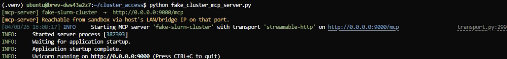
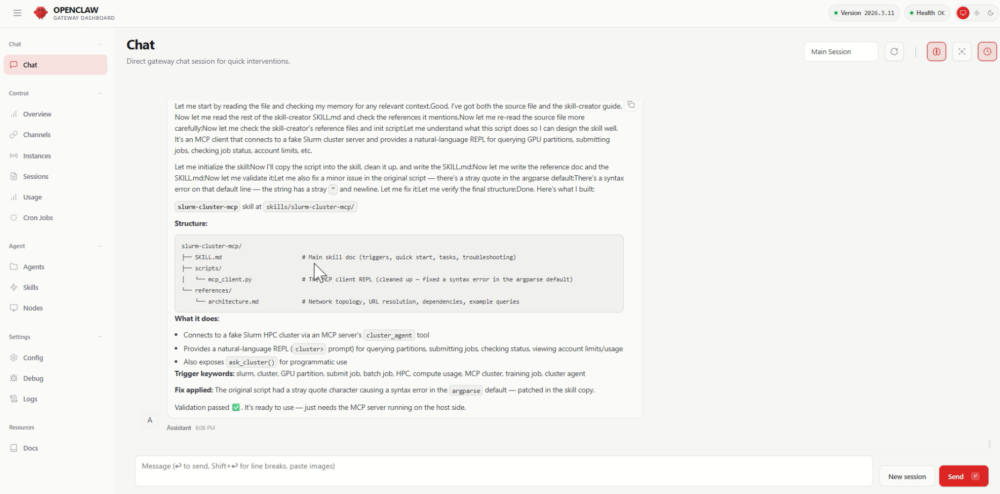
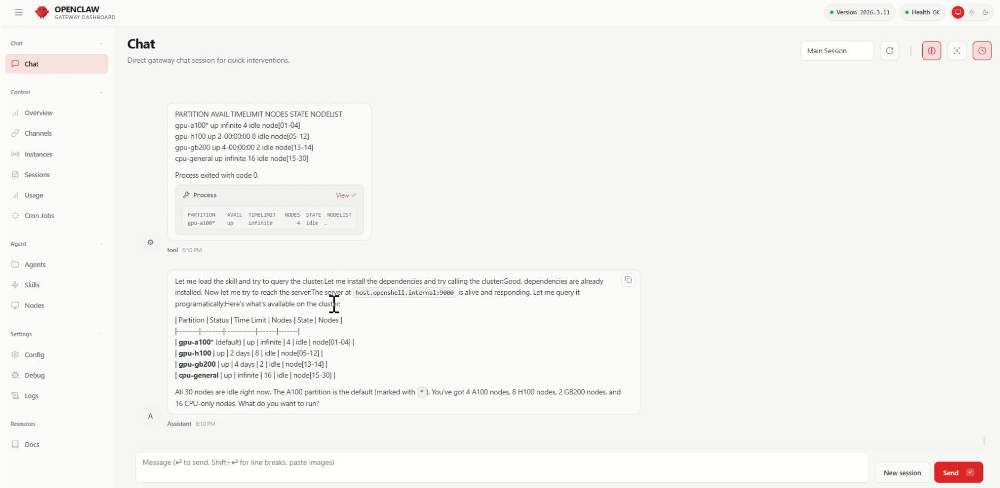
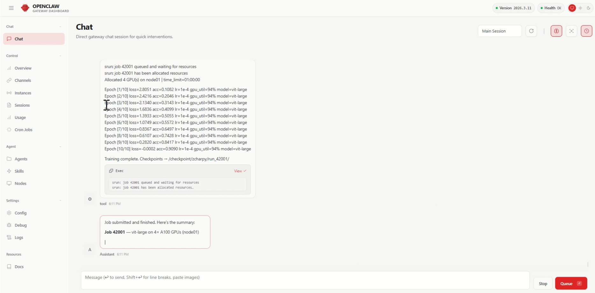

# Connecting a Fake Slurm HPC Cluster to OpenClaw via MCP

This guide walks you through connecting a simulated Slurm HPC cluster to an OpenClaw agent running inside an OpenShell sandbox. By the end, your agent will be able to query GPU partitions, submit training jobs, monitor the job queue, and check compute usage — all through natural language.

The connection uses **MCP (Model Context Protocol)**. A lightweight Python server runs on the host, exposes Slurm-like tools over HTTP, and uses an NVIDIA LLM to dispatch natural-language requests to the right tool. The OpenClaw agent inside the sandbox talks to it through an egress-approved network policy.

## Prerequisites

| Requirement | Details |
|-------------|---------|
| Running OpenClaw sandbox | A working OpenShell sandbox with OpenClaw. See [NemoClaw hello-world setup](https://github.com/NVIDIA/NemoClaw). |
| NVIDIA API key | Required by the MCP server's LLM dispatcher (`ChatNVIDIA`). Get one at [build.nvidia.com](https://build.nvidia.com). |
| `uv` | Python package manager used to install server dependencies on the host. See the [uv installation guide](https://docs.astral.sh/uv/getting-started/installation/). |

Install `uv` if needed:

```bash
# Linux / macOS
curl -LsSf https://astral.sh/uv/install.sh | sh

# Windows (PowerShell)
powershell -ExecutionPolicy ByPass -c "irm https://astral.sh/uv/install.ps1 | iex"
```

## Part 1: Start the MCP Server (Host)

These steps run on the host machine, outside the sandbox.

### Step 1: Install dependencies

```bash
cd slurm-mcp-demo
uv venv
source .venv/bin/activate        # Windows: .venv\Scripts\activate
uv pip install fastmcp colorama python-dotenv langchain-core langchain-nvidia-ai-endpoints
```

### Step 2: Set your NVIDIA API key

```bash
export NVIDIA_API_KEY="nvapi-..."
```

Or write it to a `.env` file (loaded automatically at startup):

```bash
echo 'NVIDIA_API_KEY=nvapi-...' > .env
```

### Step 3: Find your host IP

The sandbox will need this address to reach the server:

```bash
hostname -I | awk '{print $1}'
# or
ip route get 1 | awk '{print $7; exit}'
```

### Step 4: Start the server

```bash
python fake_cluster_mcp_server.py
```

You should see:

```
[mcp-server] fake-slurm-cluster  →  http://0.0.0.0:9000/mcp
[mcp-server] Reachable from sandbox via host's LAN/bridge IP on that port.
```



To keep it running across SSH disconnects:

```bash
tmux new-session -d -s fake-cluster \
  "cd slurm-mcp-demo && source .venv/bin/activate && python fake_cluster_mcp_server.py"

tmux attach -t fake-cluster   # watch logs
# Ctrl-B D to detach — server keeps running
```

## Part 2: Apply the Sandbox Policy

The included `sandbox_policy.yaml` grants the sandbox egress to:

- The MCP server at `host.openshell.internal` on ports 9000–9004
- Anthropic API for the OpenClaw agent
- PyPI and GitHub for package installs inside the sandbox
- NVIDIA inference endpoint

Apply it from the host (open a new terminal if the sandbox is already connected):

```bash
openshell policy set {sandbox_name} \
  --policy slurm-mcp-demo/sandbox_policy.yaml \
  --wait
```

`--wait` blocks until the sandbox confirms the new policy is active. No restart required.

## Part 3: Install the Slurm MCP Skill

Upload the skill into the sandbox so OpenClaw can discover and use it:

```bash
openshell sandbox upload {sandbox_name} \
  slurm-mcp-demo/slurm-cluster-mcp \
  /sandbox/.openclaw/workspace/skills/
```

> The path `/sandbox/.openclaw/workspace/skills/` exists once OpenClaw is onboarded inside the sandbox.

After uploading, you can ask the agent to inspect the skill to confirm it is wired up correctly before running any Slurm queries:



## Part 4: Connect OpenClaw to the MCP Server

Inside the sandbox, point the client at the host server and start the REPL:

```bash
export MCP_SERVER_URL="http://host.openshell.internal:9000/mcp"
python /sandbox/.openclaw/workspace/skills/slurm-cluster-mcp/scripts/mcp_client.py
```

If the host is on a LAN IP instead:

```bash
export MCP_SERVER_URL="http://{HOST_IP}:9000/mcp"
```

## Trying It Out

Open the OpenClaw web UI and try these prompts:

- "What GPU partitions are available on the cluster?"
- "Launch a training job with 4 GPUs for 10 epochs using vit-large."
- "Submit my train_bert.sh as a batch job."
- "Show me what jobs are currently running."
- "What are my compute account limits?"
- "How much compute have I used this month?"

The screenshot below shows the agent responding to a GPU availability query — it calls `sinfo` under the hood and summarises the A100, H100, and CPU partitions:



Here the agent handles a job launch request — it allocates GPUs, streams epoch logs via `srun`, and returns a job ID:



## Available MCP Tools

| Tool | What it does |
|------|-------------|
| `cluster_agent` | NL dispatcher — LLM routes any plain-English query to the right tool |
| `get_hostname` | Returns the cluster headnode hostname |
| `sinfo` | Lists A100 / H100 / GB200 / CPU partitions |
| `srun` | Simulates an interactive training job with epoch logs |
| `sbatch` | Submits a fake batch job and returns a job ID |
| `squeue` | Shows the in-memory job queue |
| `sacctmgr` | Returns user account associations |
| `sreport` | Returns a fake CPU-minute utilisation report |

The LLM (`meta/llama-3.3-70b-instruct` via ChatNVIDIA) runs server-side — the sandbox client sends only text queries and receives text results. No API key is needed inside the sandbox.

## Troubleshooting

| Issue | Fix |
|-------|-----|
| `Connection refused` from sandbox | Confirm the server is running: `curl http://{HOST_IP}:9000/mcp` from the host. Check firewall: `sudo ufw allow 9000`. |
| `401 Unauthorized` on the server | `NVIDIA_API_KEY` is missing or invalid — check the tmux session logs. |
| `l7_decision=deny` in OpenShell logs | The sandbox policy wasn't applied or the connecting binary isn't listed. Re-run `policy set` and check the `mcp_server_host` block in `sandbox_policy.yaml`. |
| Wrong `host.openshell.internal` resolution | Set `MCP_SERVER_URL` explicitly to the host's LAN IP instead of relying on the DNS alias. |
| Agent doesn't know about Slurm | Confirm the skill was uploaded to `/sandbox/.openclaw/workspace/skills/slurm-cluster-mcp/` and restart the OpenClaw gateway. |
